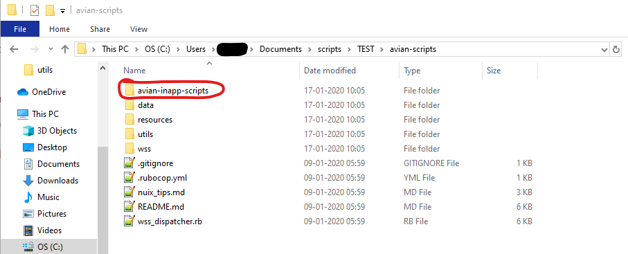

# Avian Scripts
Version 0.9.10

A collection of all scripts for Nuix created by Avian.

## Setup
1. Download the newest version of the repository here:
https://github.com/avian-digital-forensics/avian-scripts/releases/latest

2. Unpack the contents to an empty directory _not_ related to NUIX.

3. In Nuix, open the 'Scripts' menu and select 'Open Scripts Directory'.

4. From the Avian Scripts directory you just unpacked, copy the `avian-inapp-scripts` sub-directory into the directory Nuix just opened.
Not the entire directory, just the one sub-directory.

5. Run the script 'Setup' from inside NUIX.
The first time, it will ask you for the 'Avian main script directory'. 
This is the one you unpacked in step 2.

6. And that's it.
Run 'Setup' again to change anything.

## Updating
I'm afraid this means reinstalling everything.
Delete the two directories you set up and go through Setup again.

## Workstation Scripts
This is about the scripts that are run in Nuix Workstation, usually with a case already open.
If you have followed Setup correctly, these can be run from the 'Scripts' dropdown menu in Nuix under 'Avian Developed Scripts'.
Warning: For some reason NUIX always waits something like 10 seconds before running in-app scripts, so don't be alarmed when nothing happens.

For details on a specific script please read the pertaining readme.
These can be found in the script directory by following the links.

### Available in-app scripts
* [Setup](inapp-scripts/avian-workstation-scripts/setup.nuixscript) - used to setup WSS's.
* [Batched OCR](inapp-scripts/avian-workstation-scripts/batched-ocr.nuixscript) - (NOT TESTED) performs batched OCR by breaking a collection of items into a series of smaller batches and performing OCR on each smaller batch in turn.
* [Connected Addresses](inapp-scripts/avian-workstation-scripts/connected-addresses.nuixscript) - (NOT TESTED) creates a csv file with information about what addresses a specific address has exchanged messages with.
* [Find Correct Addresses](inapp-scripts/avian-workstation-scripts/find-correct-addresses.nuixscript) - (WIP) identifies all addresses and identifiers that refer to the same person and create a file with that information.
Used by the WSS 'Fix From Addresses'.
* [Find Paragraphs](inapp-scripts/avian-workstation-scripts/find-paragraphs.nuixscript) - (NOT TESTED) searches all items to look for references to paragraphs.
* [Find and Fix Unidentified Emails](inapp-scripts/avian-workstation-scripts/unidentified-emails.nuixscript) - tries to find items that should be emails but aren't identified as such by Nuix and the identify the correct communication data for them.
* [Import Printed Images](inapp-scripts/avian-workstation-scripts/import-printed-images.nuixscript) - imports printed images from directory.
* [Number of Descendants](inapp-scripts/avian-workstation-scripts/number-of-descendants.nuixscript) - gives every selected item a custom metadata value of how many descendants the item has.
* [Store Custom Entities](inapp-scripts/avian-workstation-scripts/store-custom-entities.nuixscript) - (NOT TESTED) stores information about specified custom entities to be used by other scripts.
* [Tag Messages Sent to Sender](inapp-scripts/avian-workstation-scripts/tag-messages-to-self.nuixscript) - (NOT TESTED) tags all items sent to the sender of that item.
* [Tag Exchange Emails with Duplicates](inapp-scripts/avian-workstation-scripts/tag-exchange-emails-with-duplicates.nuixscript) - tags exchange server emails with and without archived duplicates.
* [Tag Weird Characters](inapp-scripts/avian-workstation-scripts/tag-weird-characters.nuixscript) - (NOT TESTED) tags all items with names that include characters not in standard 7-bit ascii and not specified.
* [QC and Culling](inapp-scripts/avian-workstation-scripts/qc-cull.nuixscript) - automatically runs many of the processes involved in quality control.

## Automation Scripts
These are the scripts runnable in [Avian Autoprocessing](https://github.com/avian-digital-forensics/auto-processing).
Many of these scripts will have roughly equivalent in-app versions.
To see full documentation for all automation scripts, see [here](inapp-scripts/automation-scripts/script_descriptions.md).

### Available automation scripts
* Import Printed Images - imports printed images from directory.
* Number of Descendants - gives every item a custom metadata value of how many descendants the item has.

## Worker Side Scripts (WSS's)
WSS'es are run during loading of a case, and this allows them to do things regular scripts cannot.
However, this also means that they are considerably more of a hassle to run.

### Usage
1. Run the Avian in-app script 'Setup'.

2. Choose which WSS's you want.

3. Click ok.

4. Setup the loading/reloading of data as you normally do, but before you start the processing...

5. In the loading advanced settings, there should be a tab called 'Worker Script' with a single huge text field.

6. In the main Avain script directory, there is a file called `wss_caller.rb`.
Open it and copy the entire contents to the text field in the 'Worker Script' tab.

7. At the top of the tab, above the text field, there is a choice between ECMAScript, python or ruby.
Choose ruby.

8. Load the data, and the scripts you selected in step 2 should run.

Note: Steps 5 through 7 are only necessary the first time, or if the 'Worker Script' tab has been changed.
However, it is important that the script 'Setup' is run every time you use WSS's.
It may sometimes work without, but not reliably.

For details on a specific WSS please read the pertaining readme.

### Available WSS's
* [Load Timer](wss/load-timer) - adds information about load times to each item as custom metadata.
* [Add Communication to Unidentified Emails](wss/add-communication-to-unidentified-emails) - gives incorrectly loaded emails Communication metadata based on information generated by the in-app script 'Fix Unidentified Emails'.
The in-app script '[Fix Unidentified Emails](inapp-scripts/avian-workstation-scripts/unidentified-emails.nuixscript)' must be run first.
* [Fix From Addresses](wss/fix-from-addresses) - (WIP) replaces mangled addresses in the from field with correct email addresses using information generated by the in-app script 'Find Correct Addresses'.
The in-app script '[Find Correct Addresses](inapp-scripts/avian-workstation-scripts/find-correct-addresses.nuixscript)' must be run first.
* [Entities From Lists](wss/entities-from-lists) - (WIP) allows the creation of custom entities.
