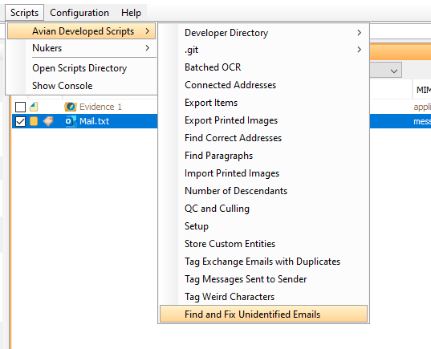
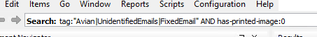

# Find and fix unidentified emails
Finds items that Nuix has not identified as emails, yet look like they should be.
These items are tagged, and a file is created that stores the items' communication information.
If the WSS '[Add Communication to Unidentified Emails](../_root/wss/add-communication-to-unidentified-emails)' is run, the items' MIME-types will be corrected and they will receive communication data.

If no items are selected a default search is run in "Find" and the found items are processed.

## How to use
In order to properly fix the unidentified emails, it will be necessary to run four scripts:

[Find and fix unidentified emails](../unidentified-emails.nuixscript)

[Export printed images](../import-printed-images.nuixscript)

[Add communication to unidentified emails](../_root/wss/add-communication-to-unidentified-emails)

[Import printed images](../import-printed-images.nuixscript)

The third of these is a WSS while the other three are in-app scripts.

### First script
The first step is to decide whether you wish to run the script on all items or only a selection.
If the latter, select these items and run the script [Find and fix unidentified emails](../unidentified-emails.nuixscript).
Otherwise, just run the script.

You should see a dialog with two tabs and a number of options.
If you selected items beforehand, make sure "Run only on selected items" is ticked in both tabs.
All other options should have fine default values, but the tooltips describe what they do.

When you are satisfied with the selected items, run the script by pressing the button in the lower right corner.
This may take a while, as much as 10 minutes per 1000 items.
When it is done, close the progress dialog and move on to the next step.

### Generate printed images
This part must be done manually, as doing it through the API requires a special license.
In order to export a printed item, it must first be generated, so do this for all items processed by the first script that don't already have a printed image.
To find these items search for 'tag:"Avian|UnidentifiedEmails|FixedEmail" AND has-printed-image:0' where FixedEmail is a standin for whatever tag you chose for fixed emails in the first script.

Query:

Context menu:

Printed images dialog:

### Second script
After the printed images have been generated they need to be exported so they can be imported by the last script.
This is done by the script [Export printed images](../export-printed-images.nuixscript).
Only run it on the items with the tag "Avian|UnidentifiedEmails|FixedEmail" in order to save time.

### Third script
If the first script has run successfully, it will have stored a file with communication information for all unidentified emails.
To use this information, we must run the WSS [Add communication to unidentified emails](../_root/wss/add-communication-to-unidentified-emails).
To do this, run the in-app script [Setup](../setup.nuixscript) and make sure the WSS is selected.
Now it is time to reload the data.
Select all items with the tag given in the "Fixed email tag" settings (the tag will have been received a prefix starting with "Avian|") and bring up the reload items dialog.
Follow steps 5-7 in the WSS guide in the [main readme](../README.md) and reload the items.

#### Note:
Some addresses may be changed to lower case.
It is not known why this happens, but the addresses given to Nuix have their cases preserved, so it must be some subtlety in Nuix.

### Fourth script
After reload, the items should have the correct communication data and MIME-types.
However, for many of them, it will no longer be possible to generate a printed image, and whatever printed image they had before will be lost.
Luckily, we have previously generated and exported printed images of all affected items.
Importing them is the purpose of the fourth script.
Run the script [Import printed images](../import-printed-images.nuixscript).
An empty dialog will come up, but just press the button in the lower right corner to run the script.
This will take a while, but once it is done, the selected items should have received the printed images from before the reload.
